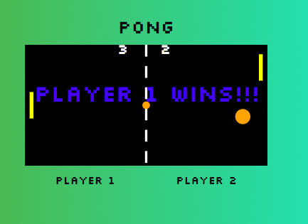

# Pong Game

A basic Pong Game with 2 wild balls. The game was built with vanilla Javascript with the graphics being rendered in SVG.

  

## Description

The Pong Game is a 2 player game. Block the ball from hitting your goal line with the paddle. First to 3 points is the winner.

## Technology Used
* HTML5
* CSS3
* SVG
* Javascript

## Built With

* Visual Studio - Code Editor
* Webpack - task runner
* Git - Github
* Chrome - dev tools

## Setup

**Install dependencies:**

`> npm i`

**Run locally with Webpack Dev Server:**

`> npm start`

**Build for production:**

`> npm run build`

## Keys

**Player 1:**
* a: up
* z: down

**Player 2:**
* ▲ : up
* ▼: down

**Pause Game**
* Space bar

## Authors

* **Aaron Griffiths** - (https://github.com/mountainmancode)

## Contributors

* Thank you Mandi from Red Academy for the code along of Pong.
* Fall 2017 Cohort
* Jim Bennett

## Observations
* It was a mind blowing experience figuring out and tracking how code from different files interact with each other. Its amazing how such a simple game can be so complex. Just so how much more room there is to grow. 